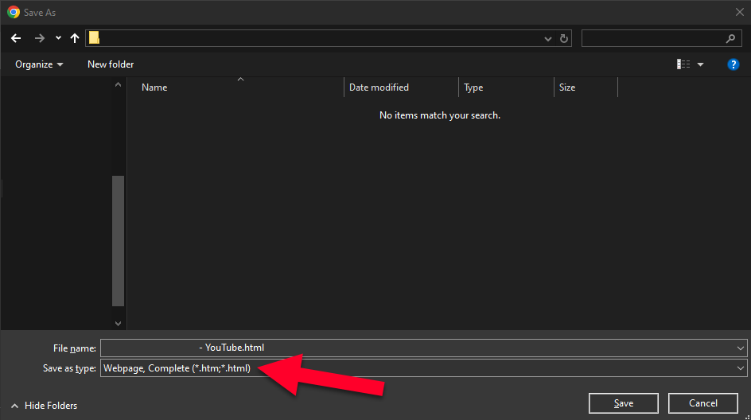

# YouTube-Channel-Restricted-Videos-Tool-Scripts
Small little python scripts to help identify which videos are shown in the YouTube channel videos. Relies and uses HTML saved pages of YouTube channel videos tab for extracting and comparing videos. 

# Dependencies
The following program and libraries is requried to use this script.
* Python 3 (3.8+)
* beautifulsoup4 Python Libary

*Included is a requirements.txt file to extract all dependencies required for the script to run*

# Script Arguments
## html_youtube_parser.py
usage: html_youtube_parser.py [-h] html_file [output_file]

Parse YouTube channel videos HTML file

positional arguments:
  html_file    Path to the downloaded HTML file
  output_file  Output JSON file path (default: videos.json)

options:
  -h, --help   show this help message and exit

## diff_json.py
usage: diff_json.py [-h] [-o OUTPUT] [-q] file1 file2

Compare two JSON files and find URL differences

positional arguments:
  file1                 First JSON file
  file2                 Second JSON file

options:
  -h, --help            show this help message and exit
  -o OUTPUT, --output OUTPUT
                        Save results to JSON file
  -q, --quiet           Only show summary, not individual URLs

Examples:
  python json_diff.py file1.json file2.json
  python json_diff.py file1.json file2.json --output results.json
  python json_diff.py file1.json file2.json --quiet

# Instructions
## Saving the pages for parsing and comparing
1. Launch your favorite web browser (preferably in a private/incognito window)
2. Go to your YouTube channel's video tab (should be https://youtube.com/<Youtube Channel ID or YouTube handle>/videos, example https://youtube.com/@ConventionCoverage/videos)
3. Check and keep note if you are viewing in restrictive mode or not by clicking on your user profile icon on the top right of the YouTube page (if signed in) or the "kebab" menu next to the "Sign In" button
4. (Optional) Ensure the videos are set to sort by "Latest"
5. Keep scrolling down on the YouTube page's video tab till it reaches the end of the list of videos
6. Save the page as a "Webpage, Complete (*.html, *.html)" to the location of the extracted files/scripts. In the filename, note which version (restricted mode or unrestricted mode) of the page you are saving in the filename. 

7. Wait for "Webpage, Complete" to complete saving.
8. Now do the steps 3-7 again for the other mode (if you just saved in unrestricted mode, now do restricted mode, and vice versa)

## Extract all video URLs from the webpage and get the difference between restricted and unrestricted mode
1. Launch a command line/command prompt/terminal instance to the directory of the extracted files/scripts. 
2. Create a python virtual environment using the command "<Python Program Executable, likely just python> -m venv ."
3. Launch a virtual environment by running "Scripts/activate" in the directory of the extracted files/scripts. 
4. Download and install all python dependencies using the command "python -r requirements.txt"
5. Run the script with the following arguments "<Python Program Executable, likely just python> html_youtube_parser.py <html file of the saved YouTube page> <restricted or unrestricted depending on which html file you are parsing for YouTube URLs>.json"
6. Do step 2 again; but this time, do it for the other html file.
7. Run the json file diff script to get a result between the two modes with the following arguments "<Python Program Executable, likely just python> diff_json.py <JSON File of the unrestricted mode>.json <JSON File of the restricted mode>.json --results results.json"
8. Open "results.json" in your favorite text exitor to see the results. The section in "only_in_file1" should contain a list of video urls that are only seen in not "Restricted Mode" while the section in "only_in_file2" should contain nothing (or the other way around if you specified the files in step 7 the other way around) 

# Notes
It was the decision for the user to supply the saved HTML page prior to using the program to parse the data instead of coding a method like requests or selenium (or other unofficial YouTube tools) to automate pulling data to alleviate the following issues that may happen:
* Prevent bot like activity from being triggered, leading to restrictions or pages from failing to pull the data it needs
* Providing user confidence and visual clarity if they are pulling on "Restricted Mode" or not.
